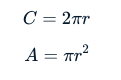
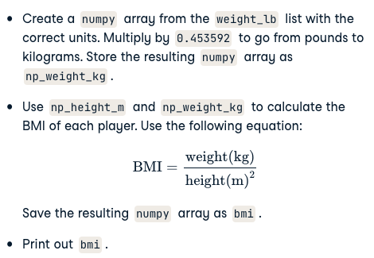

# Intro to Python

<!-- TOC -->
* [Intro to Python](#intro-to-python)
  * [Notes](#notes)
  * [Python basics and lists](#python-basics-and-lists)
    * [Python as a calculator](#python-as-a-calculator)
    * [Types](#types)
    * [Variable Assignment](#variable-assignment)
    * [Calculations with variables](#calculations-with-variables)
    * [Other variable types](#other-variable-types)
    * [Guess the type](#guess-the-type)
    * [Type conversion](#type-conversion)
    * [Create a list](#create-a-list)
    * [Create list with different types](#create-list-with-different-types)
    * [List of lists](#list-of-lists)
    * [Subset and conquer](#subset-and-conquer)
    * [Subset and calculate](#subset-and-calculate)
    * [Slicing and dicing](#slicing-and-dicing)
    * [Subsetting lists of lists](#subsetting-lists-of-lists)
    * [Replace list elements](#replace-list-elements)
    * [Extend a list](#extend-a-list)
    * [Delete list elements](#delete-list-elements)
    * [Inner workings of lists](#inner-workings-of-lists)
  * [Functions](#functions)
    * [Familiar functions](#familiar-functions)
    * [Help!](#help-)
    * [Multiple arguments](#multiple-arguments)
    * [String Methods](#string-methods)
    * [List Methods](#list-methods)
    * [Import package](#import-package)
    * [Selective import](#selective-import)
    * [Different ways of importing](#different-ways-of-importing)
  * [NumPy](#numpy)
    * [Your First NumPy Array](#your-first-numpy-array)
    * [Baseball players' height](#baseball-players-height)
    * [Baseball player's BMI](#baseball-players-bmi)
      * [Exercise instructions](#exercise-instructions)
    * [Lightweight baseball players](#lightweight-baseball-players)
      * [Exercise instructions](#exercise-instructions-1)
    * [NumPy Side Effects](#numpy-side-effects)
    * [Subsetting NumPy Arrays](#subsetting-numpy-arrays)
    * [Your First 2D NumPy Array](#your-first-2d-numpy-array)
    * [Baseball data in 2D form](#baseball-data-in-2d-form)
    * [Subsetting 2D NumPy Arrays](#subsetting-2d-numpy-arrays)
    * [2D Arithmetic](#2d-arithmetic)
    * [Average versus median](#average-versus-median)
    * [Blend it all together](#blend-it-all-together)
<!-- TOC -->

## Notes

- To run a script just write python <script>.py
- Use `print()` to generate output from script
- To add comments to your Python script, you can use the # tag. These comments are not run as Python code, so they will not influence your result. As an example, take the comment in the editor, # Division; it is completely ignored during execution.
- You can check the type with `type(<variable>)`

## Python basics and lists

### Python as a calculator

Python is perfectly suited to do basic calculations. Apart from addition, subtraction, multiplication and division, there is also support for more advanced operations such as:

- Exponentiation: `**`. This operator raises the number to its left to the power of the number to its right. For example `4**2` will give `16`.
- Modulo: `%`. This operator returns the remainder of the division of the number to the left by the number on its right. For example `18 % 7` equals `4`.

### Types

- str
- float
- int
- bool

### Variable Assignment

In Python, a variable allows you to refer to a value with a name. To create a variable use `=`, like this example:

`x = 5`

You can now use the name of this variable, `x`, instead of the actual value, `5`.

Remember, `=` in Python means assignment, it doesn't test equality!

### Calculations with variables

Remember how you calculated the money you ended up with after 7 years of investing $100? You did something like this:

`100 * 1.1 ** 7`

Instead of calculating with the actual values, you can use variables instead. The `savings` variable you've created in the previous exercise represents the $100 you started with. It's up to you to create a new variable to represent `1.1` and then redo the calculations!

### Other variable types

In the previous exercise, you worked with two Python data types:

- int, or integer: a number without a fractional part. savings, with the value 100, is an example of an integer.
- float, or floating point: a number that has both an integer and fractional part, separated by a point. growth_multiplier, with the value 1.1, is an example of a float.

Next to numerical data types, there are two other very common data types:

- str, or string: a type to represent text. You can use single or double quotes to build a string.
- bool, or boolean: a type to represent logical values. Can only be True or False (the capitalization is important!).

### Guess the type

To find out the type of a value or a variable that refers to that value, you can use the `type()` function. Suppose you've defined a variable `a`, but you forgot the type of this variable. To determine the type of `a`, simply execute:

`type(a)`

We already went ahead and created three variables: `a`, `b` and `c`. You can use the IPython shell to discover their type. Which of the following options is correct?

### Type conversion
Using the `+` operator to paste together two strings can be very useful in building custom messages.

Suppose, for example, that you've calculated the return of your investment and want to summarize the results in a string. Assuming the integer savings and float result are defined, you can try something like this:

`print("I started with $" + savings + " and now have $" + result + ". Awesome!")`

This will not work, though, as you cannot simply sum strings and integers/floats.

To fix the error, you'll need to explicitly convert the types of your variables. More specifically, you'll need `str()`, to convert a value into a string. `str(savings)`, for example, will convert the integer `savings` to a string.

Similar functions such as `int()`, `float()` and `bool()` will help you convert Python values into any type.

### Create a list

As opposed to `int`, `bool` etc., a list is a compound data type; you can group values together:

```python
a = "is"
b = "nice"
my_list = ["my", "list", a, b]
```

After measuring the height of your family, you decide to collect some information on the house you're living in. The areas of the different parts of your house are stored in separate variables for now, as shown in the script.

### Create list with different types

A list can contain any Python type. Although it's not really common, a list can also contain a mix of Python types including strings, floats, booleans, etc.

The printout of the previous exercise wasn't really satisfying. It's just a list of numbers representing the areas, but you can't tell which area corresponds to which part of your house.

The code in the editor is the start of a solution. For some of the areas, the name of the corresponding room is already placed in front. Pay attention here! `"bathroom"` is a string, while `bath` is a variable that represents the float 9.50 you specified earlier.

### List of lists
As a data scientist, you'll often be dealing with a lot of data, and it will make sense to group some of this data.

Instead of creating a flat list containing strings and floats, representing the names and areas of the rooms in your house, you can create a list of lists. The script in the editor can already give you an idea.

Don't get confused here: `"hallway"` is a string, while `hall` is a variable that represents the float `11.25` you specified earlier.

### Subset and conquer

Subsetting Python lists is a piece of cake. Take the code sample below, which creates a list `x` and then selects "b" from it. Remember that this is the second element, so it has index 1. You can also use negative indexing.

```python
x = ["a", "b", "c", "d"]
x[1]
x[-3] # same result!
```

Remember the `areas` list from before, containing both strings and floats? Its definition is already in the script. Can you add the correct code to do some Python subsetting?

### Subset and calculate

After you've extracted values from a list, you can use them to perform additional calculations. Take this example, where the second and fourth element of a list `x` are extracted. The strings that result are pasted together using the `+` operator:

```python
x = ["a", "b", "c", "d"]
print(x[1] + x[3])
```

### Slicing and dicing

Selecting single values from a list is just one part of the story. It's also possible to slice your list, which means selecting multiple elements from your list. Use the following syntax:

`my_list[start:end]`

The `start` index will be included, while the `end` index is not.

The code sample below shows an example. A list with `"b"` and `"c"`, corresponding to indexes 1 and 2, are selected from a list `x`:

```python
x = ["a", "b", "c", "d"]
x[1:3]
```

The elements with index 1 and 2 are included, while the element with index 3 is not.

### Subsetting lists of lists

You saw before that a Python list can contain practically anything; even other lists! To subset lists of lists, you can use the same technique as before: square brackets. Try out the commands in the following code sample in the IPython Shell:

```python
x = [["a", "b", "c"],
     ["d", "e", "f"],
     ["g", "h", "i"]]
x[2][0]
x[2][:2]
```

`x[2]` results in a list, that you can subset again by adding additional square brackets.

What will `house[-1][1]` return? `house`, the list of lists that you created before, is already defined for you in the workspace. You can experiment with it in the IPython Shell.

### Replace list elements

Replacing list elements is pretty easy. Simply subset the list and assign new values to the subset. You can select single elements or you can change entire list slices at once.

Use the IPython Shell to experiment with the commands below. Can you tell what's happening and why?

```python
x = ["a", "b", "c", "d"]
x[1] = "r"
x[2:] = ["s", "t"]
```

For this and the following exercises, you'll continue working on the `areas` list that contains the names and areas of different rooms in a house.

### Extend a list

If you can change elements in a list, you sure want to be able to add elements to it, right? You can use the `+` operator:

```python
x = ["a", "b", "c", "d"]
y = x + ["e", "f"]
```

You just won the lottery, awesome! You decide to build a poolhouse and a garage. Can you add the information to the `areas` list?

### Delete list elements

Finally, you can also remove elements from your list. You can do this with the `del` statement:

```python
x = ["a", "b", "c", "d"]
del(x[1])
```

Pay attention here: as soon as you remove an element from a list, the indexes of the elements that come after the deleted element all change!

The updated and extended version of `areas` that you've built in the previous exercises is coded below. You can copy and paste this into the IPython Shell to play around with the result.

```python
areas = ["hallway", 11.25, "kitchen", 18.0,
        "chill zone", 20.0, "bedroom", 10.75,
         "bathroom", 10.50, "poolhouse", 24.5,
         "garage", 15.45]
```

There was a mistake! The amount you won with the lottery is not that big after all and it looks like the poolhouse isn't going to happen. You decide to remove the corresponding string and float from the `areas` list.

The `;` sign is used to place commands on the same line. The following two code chunks are equivalent:

```python
# Same line
command1; command2

# Separate lines
command1
command2
```

Which of the code chunks will do the job for us?

### Inner workings of lists

At the end of the video, Hugo explained how Python lists work behind the scenes. In this exercise you'll get some hands-on experience with this.

The Python code in the script already creates a list with the name `areas` and a copy named `areas_copy`. Next, the first element in the `areas_copy` list is changed and the `areas` list is printed out. If you hit Run Code you'll see that, although you've changed `areas_copy`, the change also takes effect in the `areas` list. That's because `areas` and `areas_copy` point to the same list.

If you want to prevent changes in `areas_copy` from also taking effect in `areas`, you'll have to do a more explicit copy of the `areas` list. You can do this with `list()` or by using `[:]`.

## Functions

### Familiar functions

Out of the box, Python offers a bunch of built-in functions to make your life as a data scientist easier. You already know two such functions: `print()` and `type()`. You've also used the functions `str()`, `int()`, `bool()` and `float()` to switch between data types. These are built-in functions as well.

Calling a function is easy. To get the type of `3.0` and store the output as a new variable, `result`, you can use the following:

`result = type(3.0)`

The general recipe for calling functions and saving the result to a variable is thus:

`output = function_name(input)`

### Help!

Maybe you already know the name of a Python function, but you still have to figure out how to use it. Ironically, you have to ask for information about a function with another function: `help()`. In IPython specifically, you can also use `?` before the function name.

To get help on the `max()` function, for example, you can use one of these calls:

```python
help(max)
?max
```

Use the IPython Shell to open up the documentation on `pow()`. Which of the following statements is true?

### Multiple arguments

In the previous exercise, you identified optional arguments by viewing the documentation with `help()`. You'll now apply this to change the behavior of the `sorted()` function.

Have a look at the documentation of `sorted()` by typing `help(sorted)` in the IPython Shell.

You'll see that `sorted()` takes three arguments: `iterable`, `key`, and `reverse`.

`key=None` means that if you don't specify the `key` argument, it will be `None`. `reverse=False` means that if you don't specify the `reverse` argument, it will be `False`, by default.

In this exercise, you'll only have to specify `iterable` and `reverse`, not `key`. The first input you pass to `sorted()` will be matched to the `iterable` argument, but what about the second input? To tell Python you want to specify `reverse` without changing anything about `key`, you can use `=` to assign it a new value:

`sorted(____, reverse=____)`

Two lists have been created for you. Can you paste them together and sort them in descending order?

Note: For now, we can understand an iterable as being any collection of objects, e.g., a List.

### String Methods

Strings come with a bunch of methods. Follow the instructions closely to discover some of them. If you want to discover them in more detail, you can always type `help(str)` in the IPython Shell.

A string `place` has already been created for you to experiment with.

### List Methods

Strings are not the only Python types that have methods associated with them. Lists, floats, integers and booleans are also types that come packaged with a bunch of useful methods. In this exercise, you'll be experimenting with:

- `index()`, to get the index of the first element of a list that matches its input and 
- `count()`, to get the number of times an element appears in a list. 

- You'll be working on the list with the area of different parts of a house: `areas`.

Most list methods will change the list they're called on. Examples are:

- `append()`, that adds an element to the list it is called on,
- `remove()`, that removes the first element of a list that matches the input, and
- `reverse()`, that reverses the order of the elements in the list it is called on.

You'll be working on the list with the area of different parts of the house: `areas`.

### Import package

As a data scientist, some notions of geometry never hurt. Let's refresh some of the basics.

For a fancy clustering algorithm, you want to find the circumference, `C`, and area, `A`, of a circle. When the radius of the circle is `r`, you can calculate `C` and `A` as:



To use the constant `pi`, you'll need the `math` package. A variable `r` is already coded in the script. Fill in the code to calculate `C` and `A` and see how the `print()` functions create some nice printouts.

### Selective import

General imports, like `import math`, make all functionality from the `math` package available to you. However, if you decide to only use a specific part of a package, you can always make your import more selective:

`from math import pi`

Let's say the Moon's orbit around planet Earth is a perfect circle, with a radius `r` (in km) that is defined in the script.

### Different ways of importing

There are several ways to import packages and modules into Python. Depending on the import call, you'll have to use different Python code.

Suppose you want to use the function `inv()`, which is in the `linalg` subpackage of the `scipy` package. You want to be able to use this function as follows:

`my_inv([[1,2], [3,4]])`

Which `import` statement will you need in order to run the above code without an error?

## NumPy

### Your First NumPy Array

In this chapter, we're going to dive into the world of baseball. Along the way, you'll get comfortable with the basics of `numpy`, a powerful package to do data science.

A list `baseball` has already been defined in the Python script, representing the height of some baseball players in centimeters. Can you add some code here and there to create a `numpy` array from it?

```python
# Exercise
#Import the numpy package as np, so that you can refer to numpy with np.
#Use np.array() to create a numpy array from baseball. Name this array np_baseball.
#Print out the type of np_baseball to check that you got it right.

# Create list baseball
baseball = [180, 215, 210, 210, 188, 176, 209, 200]

# Import the numpy package as np

# Create a numpy array from baseball: np_baseball

# Print out type of np_baseball
```

### Baseball players' height

You are a huge baseball fan. You decide to call the MLB (Major League Baseball) and ask around for some more statistics on the height of the main players. They pass along data on more than a thousand players, which is stored as a regular Python list: `height_in`. The height is expressed in inches. Can you make a `numpy` array out of it and convert the units to meters?

`height_in` is already available and the `numpy` package is loaded, so you can start straight away (Source: stat.ucla.edu).

```python
# Exercise
# Create a numpy array from height_in. Name this new array np_height_in.
# Print np_height_in.
# Multiply np_height_in with 0.0254 to convert all height measurements from inches to meters. Store the new values in a new array, np_height_m.
# Print out np_height_m and check if the output makes sense.

# height_in is available as a regular list

# Import numpy
import numpy as np

# Create a numpy array from height_in: np_height_in

# Print out np_height_in

# Convert np_height_in to m: np_height_m

# Print np_height_m
```

### Baseball player's BMI

The MLB also offers to let you analyze their weight data. Again, both are available as regular Python lists: `height_in` and `weight_lb`. `height_in` is in inches and `weight_lb` is in pounds.

It's now possible to calculate the BMI of each baseball player. Python code to convert `height_in` to a `numpy` array with the correct units is already available in the workspace. Follow the instructions step by step and finish the game!

#### Exercise instructions



```python
# Exercise
# height_in and weight_lb are available as regular lists

# Import numpy
import numpy as np

# Create array from height_in with metric units: np_height_m
np_height_m = np.array(height_in) * 0.0254

# Create array from weight_lb with metric units: np_weight_kg

# Calculate the BMI: bmi

# Print out bmi
```

### Lightweight baseball players

To subset both regular Python lists and numpy arrays, you can use square brackets:

```python
x = [4 , 9 , 6, 3, 1]
x[1]
import numpy as np
y = np.array(x)
y[1]
```

For `numpy` specifically, you can also use boolean `numpy` arrays:

```python
high = y > 5
y[high]
```

The code that calculates the BMI of all baseball players is already included. Follow the instructions and reveal interesting things from the data!

#### Exercise instructions


```python
# height_in and weight_lb are available as a regular lists

# Import numpy
import numpy as np

# Calculate the BMI: bmi
np_height_m = np.array(height_in) * 0.0254
np_weight_kg = np.array(weight_lb) * 0.453592
bmi = np_weight_kg / np_height_m ** 2

# Create the light array

# Print out light

# Print out BMIs of all baseball players whose BMI is below 21
```

### NumPy Side Effects

As Hugo explained before, `numpy` is great for doing vector arithmetic. If you compare its functionality with regular Python lists, however, some things have changed.

First of all, `numpy` arrays cannot contain elements with different types. If you try to build such a list, some of the elements' types are changed to end up with a homogeneous list. This is known as type coercion.

Second, the typical arithmetic operators, such as `+`, `-`, `*` and `/` have a different meaning for regular Python lists and `numpy` arrays.

Have a look at this line of code:

`np.array([True, 1, 2]) + np.array([3, 4, False])`

Can you tell which code chunk builds the exact same Python object? The `numpy` package is already imported as `np`, so you can start experimenting in the IPython Shell straight away!

### Subsetting NumPy Arrays

You've seen it with your own eyes: Python lists and numpy arrays sometimes behave differently. Luckily, there are still certainties in this world. For example, subsetting (using the square bracket notation on lists or arrays) works exactly the same. To see this for yourself, try the following lines of code in the IPython Shell:

```python
x = ["a", "b", "c"]
x[1]

np_x = np.array(x)
np_x[1]
```

The script in the editor already contains code that imports `numpy` as `np`, and stores both the height and weight of the MLB players as `numpy` arrays.

### Your First 2D NumPy Array

Before working on the actual MLB data, let's try to create a 2D `numpy` array from a small list of lists.

In this exercise, `baseball` is a list of lists. The main list contains 4 elements. Each of these elements is a list containing the height and the weight of 4 `baseball` players, in this order. baseball is already coded for you in the script.

### Baseball data in 2D form

You have another look at the MLB data and realize that it makes more sense to restructure all this information in a 2D `numpy` array. This array should have 1015 rows, corresponding to the 1015 baseball players you have information on, and 2 columns (for height and weight).

The MLB was, again, very helpful and passed you the data in a different structure, a Python list of lists. In this list of lists, each sublist represents the height and weight of a single baseball player. The name of this embedded list is `baseball`.

Can you store the data as a 2D array to unlock numpy's extra functionality?

### Subsetting 2D NumPy Arrays

If your 2D `numpy` array has a regular structure, i.e. each row and column has a fixed number of values, complicated ways of subsetting become very easy. Have a look at the code below where the elements `"a"` and `"c"` are extracted from a list of lists.

```python
# regular list of lists
x = [["a", "b"], ["c", "d"]]
[x[0][0], x[1][0]]

# numpy
import numpy as np
np_x = np.array(x)
np_x[:, 0]
```

For regular Python lists, this is a real pain. For 2D `numpy` arrays, however, it's pretty intuitive! The indexes before the comma refer to the rows, while those after the comma refer to the columns. The `:` is for slicing; in this example, it tells Python to include all rows.

The code that converts the pre-loaded `baseball` list to a 2D `numpy` array is already in the script. The first column contains the players' height in inches and the second column holds player weight, in pounds. Add some lines to make the correct selections. Remember that in Python, the first element is at index 0!

### 2D Arithmetic

Remember how you calculated the Body Mass Index for all baseball players? `numpy` was able to perform all calculations element-wise (i.e. element by element). For 2D `numpy` arrays this isn't any different! You can combine matrices with single numbers, with vectors, and with other matrices.

Execute the code below in the IPython shell and see if you understand:

```python
import numpy as np
np_mat = np.array([[1, 2],
                   [3, 4],
                   [5, 6]])
np_mat * 2
np_mat + np.array([10, 10])
np_mat + np_mat
```

`np_baseball` is coded for you; it's again a 2D `numpy` array with 3 columns representing height (in inches), weight (in pounds) and age (in years).

### Average versus median

You now know how to use `numpy` functions to get a better feeling for your data. It basically comes down to importing `numpy` and then calling several simple functions on the `numpy` arrays:

```python
import numpy as np
x = [1, 4, 8, 10, 12]
np.mean(x)
np.median(x)
```

The baseball data is available as a 2D `numpy` array with 3 columns (height, weight, age) and 1015 rows. The name of this `numpy` array is `np_baseball`. After restructuring the data, however, you notice that some height values are abnormally high. Follow the instructions and discover which summary statistic is best suited if you're dealing with so-called outliers.

### Blend it all together

In the last few exercises you've learned everything there is to know about heights and weights of baseball players. Now it's time to dive into another sport: soccer.

You've contacted FIFA for some data and they handed you two lists. The lists are the following:

```python
positions = ['GK', 'M', 'A', 'D', ...]
heights = [191, 184, 185, 180, ...]
```

Each element in the lists corresponds to a player. The first list, `positions`, contains strings representing each player's position. The possible positions are: `'GK'` (goalkeeper), `'M'` (midfield), `'A'` (attack) and `'D'` (defense). The second list, `heights`, contains integers representing the height of the player in cm. The first player in the lists is a goalkeeper and is pretty tall (191 cm).

You're fairly confident that the median height of goalkeepers is higher than that of other players on the soccer field. Some of your friends don't believe you, so you are determined to show them using the data you received from FIFA and your newly acquired Python skills.